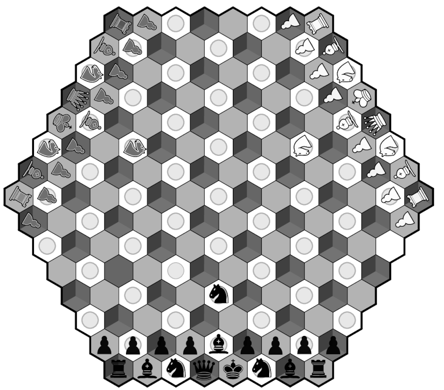
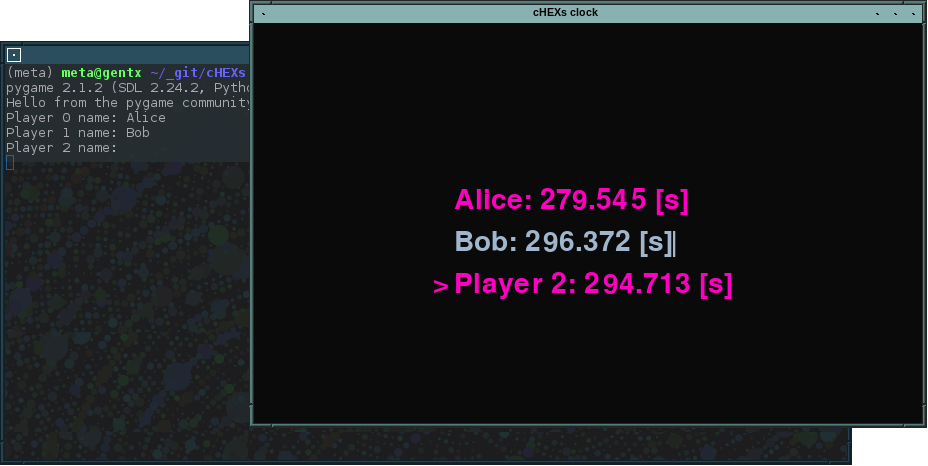

# pchess
pchess is yet another [chess variant](https://en.wikipedia.org/wiki/Hexagonal_chess) to be played on a hexagonal lattice.

While not being fundamentally different than some other variants, it was specifically designed for games involving three (or more) players while trying to keep as close as possible to the original chess rules.

Due to the way it was designed, pchess adds more depth to the temporal dimension of a chess game, while also increasing the DOF in the spatial dimension.

While the author recognizes Gliński's hexagonal chess variant is more suited for two-player mode (that is, if you really want to play hex chess) mostly because of the limited size of the board, for three-player mode it seems obvious that *pchess* is closer to traditional chess while still retaining the ability to include more than two players in a single game and on a single board.

### Player colors

Player colors are :

* white
* black
* zebra

The initial order is arbitrary and determined by the clock itself.

When more than threee players are involved, a player's color (or color combination) is chosen so that all participants in the game have no trouble making the difference between each player. This may include clues such as Braille symbols, sound clues, or whatever else.

### Cell numbering

Cell numbering is done on a redundant three-axis scale. There are basically an infinite way to refer to a specific cell, but any cell coordinate will always have a unique solution in the form of *(x;y;0)*.

There *should* (TODO) be a little snippet that converts any arbitratry coordinate triplet to it's unique, canonical *(x;y;0)* form.

## The novelty

When involving more then two players, pchess **must** be played with a clock (standard chess clocks are not suited) ; it is always the player who has the most time left on their clock whose turn it is to play, unless that player just finished a turn. The initial playing order is determined by the clock in a pseudo-random fashion.

## Board setup

There are a variety of possible board setups and variations, my favorite is shown below and features three bishops and three knights for a very dynamic gameplay. The starting position is edge-based and differs only mildly from that of standard chess.

By reducing the number of pieces used, it is possible to accomodate up to 6 players in a  massive free-for-all warfare.

The `manual/` directory contains more info of piece movement and board setups.

## Win condition

As there are a few variants of initial board setups, there also are a number of win conditions. Players can chose to declare the first player to get another in checkmate to be the winner (somehow encourages a parasitic-type of gameplay), or it may be deceided that the last playing remaining on the play field wins.

This must be decided at the game start, just like the allowed movement of knights and pawns in particular.

### Example

Alice, Bob and Charles are playing a game. Each player starts with 5 minutes (300 seconds) of time available.

* Bob starts, executes his move in 5 seconds.
* Alice comes next, and moves in 15 seconds.
* It's now Charles' turn ; however, he's feeling confident (and mabye somewhat distracted) so he choses to go make himself a cup of tea and comes back at the table 3 minutes later, having only 120 seconds left on his clock.
* Since bob has now 10 more seconds available than Alice, he gets to play.
* Then it's Alice's turn, because she definitely still has more time on her clock than Charles
* After comes Bob's turn (he also definitely has more time than Charles), then Alice, and Bob, and Alice, then Bob again and so on until either one of them drops his time below the 120 seconds mark, when Charles will finally be able to play.

If the above description of events may seem a little silly, it is because it is. There are, however, cases where a player who is satisfied with his position on the board and wishes to stay there a little while might willingly chose to play somewhat slower than usual in order to force another player's turn. Or may start to panic when they realize they are playing too slow and being more observers than contestants.

## Software implementation

Since clocks are fairly difficult to make, and fancy clocks with multiple mechanisms, random number generators and all the little gizmos inside are even more difficult to build, a simple python program was written to achieve a similar result.

At the moment, it uses [pyGame](https://www.pygame.org) but that may change in the future

### Features

* supports any number of players (including 2)
* player names can be specified

### TODO

* packaging for Android, IOs (maybe use Kivy?)
* *handicap* feature : players time credit can be individually specified, it is normalized to preserve a reasonnable playing order
* player colors
* *Pause* does not really work, barely good enough to wait for all players to be ready to start the game
* re-order player names (current player on top, next player second, then sort by decreasing time credit)
